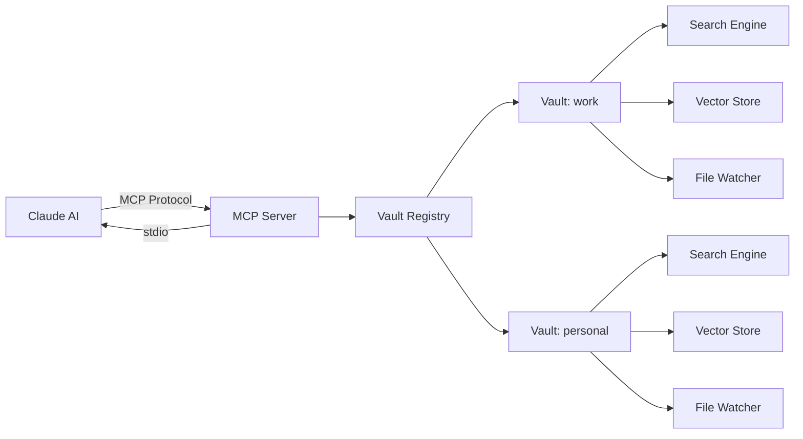

# Obsidian MCP Server

> Provides real-time Claude AI access to Obsidian vaults via Model Context Protocol (MCP)

## Overview

This MCP server enables Claude to query, search, and read notes from Obsidian vaults **without token limitations**. Unlike Claude Projects which load all documents into context, this server provides dynamic, on-demand access to your knowledge base.

## Features

- **Multi-Vault Support**: Serve multiple Obsidian vaults from a single MCP server instance (v2.0)
- **Real-time Vault Access**: Query and read notes dynamically without pre-uploading
- **Automatic Index Updates**: File system watcher automatically updates vector index when notes change (v1.3.0)
- **Vector Search**: Semantic search using local embeddings (Transformers.js) or Anthropic API
- **Hybrid Search**: Combines keyword and semantic search for optimal results
- **Write Operations**: Create, update, and delete notes programmatically
- **Cross-Vault Search**: Search across all configured vaults with `vault: "*"`
- **Search Tools**: Keyword, tag, and folder-based filtering
- **Multiple Formats**: JSON and Markdown response formats
- **Secure**: Path validation and security checks prevent unauthorized access
- **Token Efficient**: No vault size limitations or token constraints

## Quick Start

### Prerequisites

- **Node.js** 18+ (recommended: 20+)
- **TypeScript** 5.7+
- **Obsidian vault** with markdown notes
- **Claude Desktop** or MCP-compatible client

### Installation

**Windows (PowerShell):**

```powershell
# 1. Clone or navigate to repository
cd /path/to/obsidian-mcp-server

# 2. Install dependencies
npm install

# 3. Build TypeScript
npm run build

# 4. Verify build succeeded
Test-Path dist\index.js  # Should return True
```

**macOS/Linux (Bash):**

```bash
# 1. Clone or navigate to repository
cd ~/obsidian-mcp-server

# 2. Install dependencies
npm install

# 3. Build TypeScript
npm run build

# 4. Verify build succeeded
ls dist/index.js  # Should exist
```

### Configuration

Create `config.json` in the project root with your vault(s):

```json
{
  "vaults": [
    {
      "name": "work",
      "path": "C:\\Users\\YourName\\Documents\\WorkVault",
      "enableWrite": true
    },
    {
      "name": "personal",
      "path": "C:\\Users\\YourName\\Documents\\PersonalVault",
      "enableWrite": false
    }
  ],
  "vectorSearch": {
    "enabled": true,
    "provider": "transformers",
    "model": "Xenova/bge-small-en-v1.5",
    "indexOnStartup": "auto"
  },
  "searchOptions": {
    "maxResults": 20,
    "excerptLength": 200,
    "caseSensitive": false,
    "includeMetadata": true
  },
  "logging": {
    "level": "info",
    "file": "logs/mcp-server.log"
  }
}
```

**Choosing the Right Embedding Model:**

The default model (`Xenova/bge-small-en-v1.5`) offers excellent quality at 384 dimensions. Consider alternatives based on your needs:

- **Default**: `Xenova/bge-small-en-v1.5` — best quality-to-resource ratio, recommended for multi-vault setups
- **High-end CPU** (Ryzen 9+, i9+, M3 Max+): Use `Xenova/bge-base-en-v1.5` for best quality (768 dims, ~2x RAM)
- **Multilingual vault**: Use `Xenova/paraphrase-multilingual-MiniLM-L12-v2`

See [Semantic Search Guide](docs/semantic-search.md#hardware-specific-recommendations) for detailed model comparison.

### Initial Indexing (Required for Large Vaults)

**Important:** For vaults with 1,000+ notes or when switching embedding models, run initial indexing **standalone** before using Claude Desktop.

**Quick Start:**

```powershell
# Windows
$env:OBSIDIAN_VAULT_PATH = "X:\Path\To\Your\Vault"
$env:OBSIDIAN_CONFIG_PATH = "D:\repos\obsidian-mcp-server\config.json"
node --expose-gc --max-old-space-size=16384 dist\index.js
```

```bash
# macOS/Linux
export OBSIDIAN_VAULT_PATH="/path/to/vault"
export OBSIDIAN_CONFIG_PATH="$HOME/obsidian-mcp-server/config.json"
node --expose-gc --max-old-space-size=16384 dist/index.js
```

After indexing completes, configure Claude Desktop (see below) for daily usage.

> **📚 See [Indexing Workflow Guide](docs/indexing-workflow.md)** for detailed instructions, troubleshooting, and model switching procedures.

### Claude Desktop Integration

#### Windows

Edit Claude Desktop configuration:

```powershell
# Config location: %APPDATA%\Claude\claude_desktop_config.json
notepad "$env:APPDATA\Claude\claude_desktop_config.json"
```

Add this configuration:

```json
{
  "mcpServers": {
    "obsidian": {
      "command": "node",
      "args": [
        "--expose-gc",
        "--max-old-space-size=16384",
        "/path/to/obsidian-mcp-server/dist/index.js"
      ],
      "env": {
        "OBSIDIAN_CONFIG_PATH": "/path/to/obsidian-mcp-server/config.json"
      }
    }
  }
}
```

#### macOS

Edit Claude Desktop configuration:

```bash
# Config location: ~/Library/Application Support/Claude/claude_desktop_config.json
vi ~/Library/Application\ Support/Claude/claude_desktop_config.json
```

Add this configuration:

```json
{
  "mcpServers": {
    "obsidian": {
      "command": "node",
      "args": [
        "--expose-gc",
        "--max-old-space-size=16384",
        "/path/to/obsidian-mcp/dist/index.js"
      ],
      "env": {
        "OBSIDIAN_CONFIG_PATH": "/path/to/obsidian-mcp-server/config.json"
      }
    }
  }
}
```

#### Multi-Vault Setup

The server natively supports multiple vaults via the `vaults` array in `config.json`. All vaults are served by a single MCP server process — no need for separate server entries per vault.

Each vault gets its own independent vector index (stored in each vault's `.mcp-vector-store/` folder) and file watcher. Use the `vault` parameter on all tools to target a specific vault, or `"*"` on read tools to search across all vaults.

```json
{
  "vaults": [
    {
      "name": "work",
      "path": "C:\\Users\\YourName\\Documents\\WorkVault",
      "enableWrite": true
    },
    {
      "name": "personal",
      "path": "C:\\Users\\YourName\\Documents\\PersonalVault",
      "enableWrite": false
    }
  ],
  "vectorSearch": {
    "enabled": true,
    "provider": "transformers",
    "model": "Xenova/bge-small-en-v1.5",
    "indexOnStartup": "auto"
  }
}
```

**Memory planning**: Each vault loads the embedding model independently (~150-300MB RAM per vault depending on model). Plan memory accordingly.

> **Legacy Note:** If you previously used `OBSIDIAN_VAULT_PATH` with one server process per vault, the server auto-migrates this to a single-vault `vaults` array at startup. The old multi-process approach still works but is no longer recommended.

#### Restart Claude Desktop

After configuration, **completely quit and restart Claude Desktop** for changes to take effect.

## Documentation

- **[Indexing Workflow Guide](docs/indexing-workflow.md)** - Initial setup, model switching, and troubleshooting
- **[Configuration Guide](docs/configuration.md)** - Complete configuration reference
- **[Semantic Search Guide](docs/semantic-search.md)** - Semantic search setup and usage

## Usage

### In Claude Conversations

Once configured, Claude can automatically access your vault:

```text
User: "Search my vault for notes about Python debugging"

Claude will use: obsidian_search_vault(query="Python debugging")
Returns: Matching notes with excerpts and URIs

User: "Show me the full Getting-Started note"

Claude will read: obsidian://vault/Guides/Getting-Started.md
Returns: Complete note content
```

### Available Tools

All tools require a `vault` parameter specifying which vault to operate on. Use the vault name from your `config.json`. Read tools also accept `"*"` for cross-vault search.

#### obsidian_list_vaults

List all configured vaults with their status and metadata.

**Parameters**: None required.

**Returns**: Vault names, paths, write status, and index health (note count, model, indexed date).

#### obsidian_search_vault

Search vault by keywords, tags, or folders.

**Parameters:**

- `vault` (required): Vault name or `"*"` for all vaults
- `query` (required): Search keywords (space-separated)
- `tags` (optional): Filter by tags (must have ALL)
- `folders` (optional): Limit to specific folders
- `limit` (optional): Max results (1-100, default: 20)
- `offset` (optional): Pagination offset (default: 0)
- `response_format` (optional): "markdown" or "json" (default: "markdown")

**Examples:**

```typescript
// Search a specific vault
obsidian_search_vault((vault = "work"), (query = "JavaScript testing"));

// Search across all vaults
obsidian_search_vault((vault = "*"), (query = "project"), (tags = ["active"]));
```

#### obsidian_semantic_search

Search vault using semantic similarity (meaning-based) instead of keyword matching.

**Parameters:**

- `vault` (required): Vault name or `"*"` for all vaults
- `query` (required): Natural language query (1-500 chars)
- `limit` (optional): Max results (1-50, default: 10)
- `min_score` (optional): Similarity threshold (0-1, default: 0.5)
- `hybrid` (optional): Combine with keyword search (default: false)
- `response_format` (optional): "markdown" or "json" (default: "markdown")

**Examples:**

```typescript
// Semantic search in one vault
obsidian_semantic_search((vault = "work"), (query = "machine learning ethics"));

// Cross-vault hybrid search
obsidian_semantic_search(
  (vault = "*"),
  (query = "web development best practices"),
  (hybrid = true)
);
```

#### obsidian_read_note

Read the full content of a specific note with parsed frontmatter. Read-only operation.

**Parameters:**

- `vault` (required): Vault name (no `"*"`)
- `path` (required): Relative path to note (e.g., "Projects/MyNote.md")
- `response_format` (optional): "markdown" or "json" (default: "markdown")

#### obsidian_create_note

Create a new note in a specific vault. Write must be enabled for the target vault.

**Parameters:**

- `vault` (required): Vault name (no `"*"`)
- `path` (required): Relative path for new note (e.g., "Projects/NewNote.md")
- `content` (required): Note content (markdown)
- `frontmatter` (optional): YAML frontmatter object

#### obsidian_update_note

Update an existing note's content or frontmatter.

**Parameters:**

- `vault` (required): Vault name (no `"*"`)
- `path` (required): Relative path to note
- `content` (optional): New content (replaces existing)
- `frontmatter` (optional): New frontmatter (merges with existing)
- `append` (optional): Append content instead of replace (default: false)

#### obsidian_delete_note

Delete a note from a specific vault. Write must be enabled for the target vault.

**Parameters:**

- `vault` (required): Vault name (no `"*"`)
- `path` (required): Relative path to note
- `confirm` (required): Must be `true` to confirm deletion

### Available Resources

Every note in your vault is exposed as a resource with URI:

```text
obsidian://vault/{vaultName}/[relative-path]
```

Claude can list all available notes and read specific notes by URI.

## Architecture

### Design Philosophy

This server uses a **search-tool-only** approach rather than pre-registering thousands of individual resources:

- **Efficient**: Claude uses `obsidian_search_vault` to find notes dynamically
- **Scalable**: Works with vaults of any size (tested with 5,000+ notes)
- **Fast**: No startup delay from resource registration
- **MCP-compliant**: Follows best practices for large datasets

Claude discovers notes through search, receives `obsidian://vault/` URIs, and can then read specific notes on demand.

### Component Diagram


```mermaid
graph LR
    A[Claude AI] -->|MCP Protocol| B[MCP Server]
    B -->|stdio| A
    B --> C[Vault Registry]
    C --> D1[Vault: work]
    C --> D2[Vault: personal]
    D1 --> E1[Search Engine]
    D1 --> F1[Vector Store]
    D1 --> G1[File Watcher]
    D2 --> E2[Search Engine]
    D2 --> F2[Vector Store]
    D2 --> G2[File Watcher]
```

### Components

- **index.ts** - Server initialization, multi-vault setup, and transport
- **obsidian-server.ts** - MCP request handlers (resources, tools) with vault routing
- **vault-registry.ts** - Multi-vault context management and resolution
- **search.ts** - Search engine with scoring and filtering
- **embeddings.ts** - Vector store and embedding generation
- **utils.ts** - Configuration, file operations, security

## Security

### Path Validation

All file paths are validated to prevent directory traversal attacks:

```typescript
// Checks that requested path is within vault boundaries
if (!isPathSafe(notePath, vaultPath)) {
  throw new Error("Access denied: path outside vault");
}
```

### Read-Only Mode

By default, server is **read-only**. To enable write operations (future feature):

```json
{
  "enableWrite": true
}
```

### Input Sanitization

- **Zod schemas** validate all tool inputs
- **Path normalization** prevents Windows/Unix path issues
- **Query limits** prevent resource exhaustion (max 500 chars)

## Development

### Build

```bash
npm run build
```

### Development Mode (Hot Reload)

```bash
npm run dev
```

### Linting

```bash
npm run lint
npm run format
```

### Testing

```bash
npm test
```

## Troubleshooting

### Server Not Starting

**Check vault path:**

```powershell
# Windows
Test-Path "C:\Users\YourName\Documents\ObsidianVault"  # Should return True
```

```bash
# macOS/Linux
ls -la ~/Documents/ObsidianVault  # Should show folder contents
```

**Check build output:**

```powershell
# Windows
Test-Path .\dist\index.js  # Should return True
```

```bash
# macOS/Linux
ls dist/index.js  # Should exist
```

**View error logs:**

```bash
# All platforms
node dist/index.js
```

### Claude Not Finding Server

1. **Verify config file location:**
   - Windows: `%APPDATA%\Claude\claude_desktop_config.json`
   - macOS: `~/Library/Application Support/Claude/claude_desktop_config.json`

2. **Check JSON syntax:** Use a JSON validator

3. **Restart Claude Desktop completely** (don't just close window)

4. **Check Claude logs:**
   - Windows: `%APPDATA%\Claude\logs\`
   - macOS: `~/Library/Logs/Claude/`

### Search Returns No Results

- **Check exclude patterns** - Your notes might be excluded
- **Verify file extension** - Only `.md` files are indexed
- **Check query terms** - Try broader terms

### Permission Errors

Ensure your user has read access to:

- Vault directory
- All subdirectories
- All `.md` files

## Configuration Options

Full configuration schema:

```typescript
{
  vaults: Array<{                   // Vault definitions (required)
    name: string;                   // Unique vault identifier
    path: string;                   // Absolute path to vault
    enableWrite?: boolean;          // Per-vault write override
    includePatterns?: string[];     // Per-vault include override
    excludePatterns?: string[];     // Per-vault exclude override
    vectorSearch?: { ... };         // Per-vault vector config override
  }>;
  includePatterns: string[];        // Default glob patterns to include
  excludePatterns: string[];        // Default glob patterns to exclude
  enableWrite: boolean;             // Default write permission (default: false)
  vectorSearch?: {                  // Default vector search config
    enabled: boolean;               // Enable semantic search
    provider: "transformers";       // Embedding provider
    model?: string;                 // Model name (default: Xenova/bge-small-en-v1.5)
    indexOnStartup: "auto" | "always" | "never" | boolean;
  };
  searchOptions: {
    maxResults: number;             // Max search results (default: 20)
    excerptLength: number;          // Excerpt length (default: 200)
    caseSensitive: boolean;         // Case-sensitive search (default: false)
    includeMetadata: boolean;       // Include frontmatter (default: true)
  };
  logging: {
    level: string;                  // Log level (default: "info")
    file: string;                   // Log file path
  };
}
```

## Performance

### Optimization Strategies

- **Lazy loading** - Only reads files when requested
- **Pagination** - Limits search results
- **Character limits** - Truncates large responses
- **Exclude patterns** - Skips unnecessary files

### Recommended Limits

- **Vault size**: < 10,000 notes
- **Search results**: < 100 per query
- **File size**: < 10MB per note

### Future Enhancements

- **Indexing** - Pre-build search index for faster queries
- **Caching** - Cache frontmatter and metadata
- **Vector search** - Semantic similarity search
- **Watch mode** - Real-time file system monitoring

## MCP Protocol Compliance

This server follows [MCP best practices](https://modelcontextprotocol.io/):

- ✅ Zod input validation
- ✅ Tool annotations (readOnlyHint, destructiveHint, etc.)
- ✅ Multiple response formats (JSON/Markdown)
- ✅ Character limits (25k) with truncation
- ✅ Proper error handling
- ✅ Pagination support
- ✅ Security validation
- ✅ Descriptive tool documentation
- ✅ Search-tool pattern for large datasets

## Changelog

### v2.0.0 (January 2025) - Multi-Vault Support

**New Features**:

- ✅ **Multi-vault support**: Serve multiple Obsidian vaults from a single MCP server instance
- ✅ **`obsidian_list_vaults` tool**: List all configured vaults with index health and metadata
- ✅ **`vault` parameter**: All tools require a `vault` parameter for explicit targeting
- ✅ **Cross-vault search**: Use `vault: "*"` on read tools to search across all vaults
- ✅ **Per-vault config**: Override write permissions, include/exclude patterns, and vector search settings per vault
- ✅ **Per-vault file watchers**: Independent file watching and auto-indexing per vault
- ✅ **Updated URI scheme**: `obsidian://vault/{vaultName}/{path}` includes vault context

**Configuration**:

- ✅ **`vaults` array**: Define multiple vaults in `config.json`
- ✅ **Legacy migration**: `OBSIDIAN_VAULT_PATH` env var auto-migrates to single-vault `vaults` array
- ✅ **Per-vault overrides**: enableWrite, includePatterns, excludePatterns, vectorSearch inherit from server defaults

**Breaking Changes**:

- ⚠️ **`vault` parameter required**: All tools now require a `vault` parameter
- ⚠️ **URI scheme changed**: URIs now include vault name: `obsidian://vault/{vaultName}/{path}`
- ⚠️ **Config format**: `vaults` array is the recommended config format (legacy auto-migration preserves backward compatibility)

**Migration**:

- Existing configs with `OBSIDIAN_VAULT_PATH` continue to work via auto-migration
- Update tool calls to include `vault` parameter
- Update any URI parsing to handle the new `{vaultName}` segment

### v1.4.0 (December 2025) - Parallel Batch Processing & Smart Auto-Indexing

**Performance Improvements**:

- 🚀 **10x faster indexing**: Parallel batch processing with Promise.all (10 concurrent embeddings)
- ⚡ **65x speedup**: 5,681 notes indexed in 5.5 minutes (down from 6+ hours)
- 💾 **Robust checkpoints**: Proper Vectra transaction management (beginUpdate/endUpdate)
- 🔧 **Memory optimized**: Explicit GC at checkpoints, pipeline refresh every 500 notes
- 📊 **Production tested**: Successfully indexed 5,681/6,056 notes (93.8% coverage)

**New Features**:

- ✅ **Smart `indexOnStartup` modes**: `"auto"` (smart detection), `"always"`, `"never"`
- ✅ **Automatic model change detection**: No manual config toggling when switching models
- ✅ **Index validation**: Detects missing, corrupted, or incompatible indexes
- ✅ **Model metadata storage**: Stores model info in index for validation
- ✅ **Seamless model switching**: Just change model in config and restart - auto re-indexes

**Bug Fixes**:

- ✅ **Fixed checkpoint persistence**: Vectra index now properly flushed to disk at checkpoints
- ✅ **Eliminated index loss**: Transaction management prevents progress loss on crashes
- ✅ **Type safety**: Fixed batch processing parameter types for NoteMetadata

**Breaking Changes**:

- ⚠️ **`indexOnStartup` enhanced**: Now accepts string values (`"auto"`, `"always"`, `"never"`) in addition to boolean (backwards compatible)
- ⚠️ **Default changed**: `indexOnStartup` now defaults to `"auto"` instead of `false`

**Migration**:

- Old config with `true`/`false` still works (mapped to `"always"`/`"never"`)
- Recommended: Update to `"auto"` for best experience
- **Delete old indexes**: If you have incomplete indexes from v1.3, delete `.mcp-vector-store/` and let v1.4 rebuild with parallel processing

### v1.3.0 (October 2025) - Automatic Index Updates

**New Features**:

- ✅ **Automatic file watching**: Real-time vector index updates when notes change (chokidar)
- ✅ **Debounced re-indexing**: Smart 2-second delay prevents excessive rebuilds
- ✅ **Seamless integration**: No manual re-indexing required

**Breaking Changes**:

- ⚠️ **Config property renamed**: `autoIndex` → `indexOnStartup` (better reflects that it only controls initial indexing on server startup, not the automatic file watching)

### v1.2.0 (October 2025) - Vector Search & Write Operations

**New Features**:

- ✅ **Semantic search** with vector embeddings (Transformers.js)
- ✅ **Write operations**: Create, update, and delete notes
- ✅ **Hybrid search**: Combine semantic and keyword search (60/40 weighting)
- ✅ **Incremental indexing**: Track file modifications for efficient updates
- ✅ **Local embeddings**: Privacy-first with local Transformers.js models

**Bug Fixes**:

- ✅ Fixed config.json loading to use script directory instead of CWD
- ✅ Fixed tags handling for non-array frontmatter tags
- ✅ Improved error handling for malformed YAML frontmatter

**Performance**:

- ✅ Tested with 5,457 note vault (5,456 indexed successfully)
- ✅ Fast startup with optional auto-indexing
- ✅ Vectra-based local vector store (no external server required)

### v1.0.0 (January 2025) - Production Release

**Architecture**:

- ✅ Search-tool-only design (no resource pre-registration)
- ✅ Fast startup (< 1 second)
- ✅ Scalable to vaults of any size

**Security**:

- ✅ Updated all dependencies (0 vulnerabilities)
- ✅ ESLint 9.17.0, Rimraf 6.0.1, TypeScript-ESLint 8.18.2
- ✅ Eliminated deprecated packages with memory leak risks

**MCP SDK**:

- ✅ Migrated to MCP SDK 1.20+ API
- ✅ Updated from old `registerResourceList`/`registerResource` methods
- ✅ Clean TypeScript compilation (0 errors)

**Testing**:

- ✅ Verified with 5,453 note vault
- ✅ Tested on Windows 11 with Node.js 25.0.0
- ✅ Confirmed Claude Desktop integration

## License

MIT License - See LICENSE file for details

## Contributing

Contributions welcome! Please:

1. Follow existing code style
2. Add tests for new features
3. Update documentation
4. Follow MCP best practices

## References

- [MCP Specification](https://modelcontextprotocol.io/)
- [MCP TypeScript SDK](https://github.com/modelcontextprotocol/typescript-sdk)
- [Claude MCP Documentation](https://docs.anthropic.com/en/docs/agents-and-tools/mcp)
- [Obsidian API](https://docs.obsidian.md/)

---

**Built with ❤️ for the Obsidian + Claude community**
