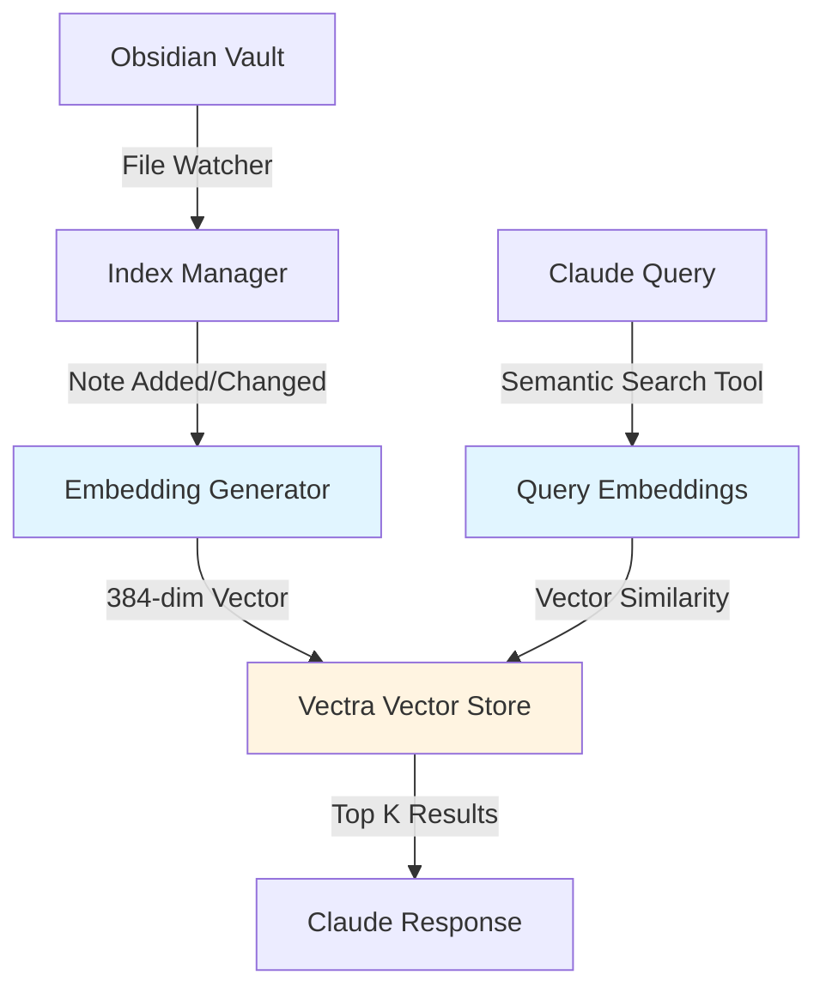

# Semantic Search Feature

## Overview

Semantic search enables Claude to find notes based on **meaning and context**, not just keyword matching. It uses AI embeddings (vector representations) to discover conceptually related content, even when exact words don't match.

### Traditional Keyword vs. Semantic Search

**Keyword Search:**

```text
Query: "authentication methods"
Finds: Notes containing "authentication" AND "methods"
Misses: Notes about "SSO", "OAuth", "MFA" (related concepts, different words)
```

**Semantic Search:**

```text
Query: "authentication methods"
Finds:
  - Notes about "OAuth and SAML configuration" (0.89 similarity)
  - "Multi-factor authentication setup" (0.85)
  - "Single sign-on best practices" (0.82)
  - "Identity provider integration" (0.78)
→ Understands these are ALL about authentication concepts
```

## Features

- **Semantic Search**: Find notes by meaning, not just keywords
- **Automatic Index Updates**: Real-time file system watching keeps index synchronized (v1.3.0)
- **Hybrid Search**: Combine semantic similarity with keyword matching for best results
- **Local Embeddings**: Uses Transformers.js for privacy-friendly, API-free embeddings
- **Incremental Indexing**: Only re-index changed notes (tracked by modification time)
- **Configurable**: Enable/disable, choose embedding model, auto-index on startup
- **Vectra Storage**: Lightweight local vector database - no server required

## Installation

The vector search dependencies are already included in `package.json`:

```bash
npm install
```

Key dependencies:
- `vectra` - Lightweight local vector database for Node.js
- `@xenova/transformers` - Local transformer models for embeddings
- `@anthropic-ai/sdk` - (Optional) For future Anthropic embeddings support

## Configuration

Add the `vectorSearch` section to your `config.json`:

```json
{
  "vectorSearch": {
    "enabled": true,
    "provider": "transformers",
    "model": "Xenova/all-MiniLM-L6-v2",
    "indexOnStartup": "auto"
  },
  "searchOptions": {
    "maxResults": 20,
    "excerptLength": 200
  }
}
```

**Note**: Vault path is set via `OBSIDIAN_VAULT_PATH` environment variable, not in config.json.

### Configuration Options

| Option           | Type    | Default                     | Description                                                        |
| ---------------- | ------- | --------------------------- | ------------------------------------------------------------------ |
| `enabled`        | boolean | `false`                     | Enable/disable semantic search                                     |
| `provider`       | string  | `"transformers"`            | Embedding provider (`"transformers"` or `"anthropic"`)             |
| `model`          | string  | `"Xenova/all-MiniLM-L6-v2"` | Embedding model to use                                             |
| `indexOnStartup` | boolean | `true`                      | Index vault on server startup (file watcher maintains index after) |

### Supported Models

**Transformers.js Models** (local, no API key required):

#### Recommended Models by Use Case

**1. `Xenova/all-MiniLM-L6-v2` - Default Choice** ⭐
- **Dimensions**: 384
- **Model Size**: 23 MB
- **Parameters**: 22M
- **Speed**: ~50ms per note (Intel i5/AMD Ryzen 5 or better)
- **Quality**: Good for general document similarity
- **Index Time**: 4-5 minutes (5,000 notes)
- **Storage**: ~2-3 KB per note (~20 MB for 5,000 notes)
- **Best for**: Default users, proven reliability, good balance

**2. `Xenova/bge-small-en-v1.5` - Best 384-Dimension Model** 🚀
- **Dimensions**: 384
- **Model Size**: 33 MB
- **Parameters**: 33M
- **Speed**: ~60ms per note
- **Quality**: State-of-the-art at 384-dim (MTEB benchmark leader)
- **Index Time**: 5-6 minutes (5,000 notes)
- **Storage**: ~2-3 KB per note (~20 MB for 5,000 notes)
- **Best for**: Users wanting best quality without storage overhead

**3. `Xenova/bge-base-en-v1.5` - Highest Quality** 🏆
- **Dimensions**: 768 (2x larger embeddings)
- **Model Size**: 109 MB
- **Parameters**: 109M
- **Speed**: ~150ms per note (requires fast CPU: Ryzen 7+, i7+, M2+)
- **Quality**: Best overall quality for English text retrieval
- **Index Time**: 12-15 minutes (5,000 notes)
- **Storage**: ~4-6 KB per note (~40 MB for 5,000 notes)
- **Best for**: High-end hardware, quality-critical use cases, research vaults
- **Hardware Recommendation**: AMD Ryzen AI MAX+ PRO, Intel i9-13900K+, Apple M3 Max+

**4. `Xenova/all-mpnet-base-v2` - Alternative High-Quality**
- **Dimensions**: 768
- **Model Size**: 109 MB
- **Parameters**: 109M
- **Speed**: ~150-200ms per note
- **Quality**: Very good, slightly behind BGE models
- **Best for**: Users already familiar with MPNet models

**5. `Xenova/paraphrase-multilingual-MiniLM-L12-v2` - Multilingual**
- **Dimensions**: 384
- **Model Size**: 118 MB
- **Parameters**: 118M
- **Speed**: ~100ms per note
- **Languages**: 50+ languages (English, Spanish, French, German, Chinese, Japanese, Arabic, etc.)
- **Quality**: Good for cross-language search
- **Best for**: Multilingual vaults, international users
- **Note**: Slightly lower quality than English-only models for English text

#### Model Performance Comparison

| Model               | Quality Score | Speed | Storage | Use Case         |
| ------------------- | ------------- | ----- | ------- | ---------------- |
| all-MiniLM-L6-v2    | ⭐⭐⭐⭐          | ⚡⚡⚡   | 💾       | Default          |
| bge-small-en-v1.5   | ⭐⭐⭐⭐⭐         | ⚡⚡⚡   | 💾       | **Best Overall** |
| bge-base-en-v1.5    | ⭐⭐⭐⭐⭐         | ⚡⚡    | 💾💾      | Premium          |
| all-mpnet-base-v2   | ⭐⭐⭐⭐          | ⚡⚡    | 💾💾      | Alternative      |
| multilingual-MiniLM | ⭐⭐⭐           | ⚡⚡    | 💾       | Languages        |

### Hardware-Specific Recommendations

**High-End CPU (Ryzen 9+, Intel i9+, M3 Max+, 64GB+ RAM)**:
- **Model**: `Xenova/bge-base-en-v1.5`
- **Why**: 16+ cores easily handle 768-dim embeddings, best quality available
- **Expected**: ~12-15 min initial index (5,000 notes), ~100-120ms per update

**Mid-Range CPU (Ryzen 5-7, Intel i5-i7, M2, 16-32GB RAM)**:
- **Model**: `Xenova/bge-small-en-v1.5`
- **Why**: Best quality at 384-dim, minimal overhead

**Budget/Older CPU (4-8 cores, 8-16GB RAM)**:
- **Model**: `Xenova/all-MiniLM-L6-v2` (default)
- **Why**: Proven, fast, reliable

**Apple Silicon (M2+, 16GB+ unified memory)**:
- **Model**: `Xenova/bge-base-en-v1.5`
- **Why**: Neural engine acceleration makes 768-dim fast

**Laptop/Battery Constrained**:
- **Model**: `Xenova/all-MiniLM-L6-v2`
- **Why**: Lower power consumption, faster inference

### Technical Implementation

**Embedding Generation** (from `src/embeddings.ts`):

```typescript
import { pipeline } from '@xenova/transformers';

// Load model once at startup
const embedder = await pipeline(
  'feature-extraction',
  'Xenova/all-MiniLM-L6-v2'
);

// Generate embedding (runs on your CPU/GPU)
async generateEmbedding(text: string): Promise<number[]> {
  const output = await embedder(text, {
    pooling: 'mean',
    normalize: true
  });
  return Array.from(output.data);  // [0.123, -0.456, 0.789, ...]
}
```

**Search Process**:

```typescript
// 1. Convert query to vector
const queryEmbedding = await generateEmbedding(query);

// 2. Find similar vectors (cosine similarity)
const results = await vectorStore.query({
  vector: queryEmbedding,
  topK: 10,
  minScore: 0.7  // 70% similarity threshold
});

// 3. Return ranked results
return results.map(r => ({
  path: r.metadata.path,
  title: r.metadata.title,
  similarity: r.score,  // 0.0 to 1.0
  excerpt: extractExcerpt(r.metadata.content)
}));
```

## Changing Embedding Models

### When to Change Models

- **Upgrade quality**: Moving from `all-MiniLM-L6-v2` to `bge-base-en-v1.5`
- **Optimize speed**: Switching to faster model on slower hardware
- **Add languages**: Switching to multilingual model
- **Reduce storage**: Moving from 768-dim to 384-dim model

### Important: Models Are Not Compatible

⚠️ **Critical**: Different models produce different embedding dimensions and values. You **cannot mix** vectors from different models in the same index.

**You must delete the entire index and rebuild it when changing models.**

### Step-by-Step Guide to Change Models

#### Step 1: Update Configuration

Edit your `config.json`:

```json
{
  "vectorSearch": {
    "enabled": true,
    "provider": "transformers",
    "model": "Xenova/bge-base-en-v1.5",  // ← Change this
    "indexOnStartup": "auto"              // ← Use "auto" (or "always" to force)
  }
}
```

**Note**: With `"auto"` mode, the server will automatically detect the model change and re-index. You don't need to manually toggle the setting!

#### Step 2: Delete Existing Vector Index

**Windows (PowerShell)**:

```powershell
# Replace with your vault path
Remove-Item "C:\Users\YourName\Documents\ObsidianVault\.mcp-vector-store" -Recurse -Force
```

**macOS/Linux (Terminal)**:

```bash
# Replace with your vault path
rm -rf ~/Documents/ObsidianVault/.mcp-vector-store
```

**What gets deleted**:
- `.mcp-vector-store/index.json` - Vector embeddings (~20-40 MB)
- `.mcp-vector-store/index-metadata.json` - File modification times (~1 MB)

**Note**: This only deletes the search index, not your actual notes!

#### Step 3: Restart MCP Server

**If using Claude Desktop**:

1. Completely quit Claude Desktop (File → Quit, or Alt+F4)
2. Wait 5 seconds for processes to terminate
3. Relaunch Claude Desktop

**If running server manually**:

```powershell
# Stop current server (Ctrl+C)
# Restart server
node dist/index.js
```

#### Step 4: Wait for Re-Indexing

The server will automatically rebuild the index on startup (because `indexOnStartup: true`).

**Monitor progress in logs**:

```powershell
# Watch the log file
Get-Content "logs\mcp-server.log" -Wait -Tail 50
```

**Look for**:

```text
**Look for**:

```text
[MCP Vector] Initializing transformer model...
[MCP Vector] Transformer model loaded
[MCP Vector] Starting indexing: 5000 notes
[MCP Vector] Indexed 100/5000 notes
[MCP Vector] Indexed 200/5000 notes
...
[MCP Vector] Indexing complete: 5000 indexed, 0 skipped, 0 failed
[MCP Vector] File system watcher active - index will update automatically
```

**Expected time**:
- **384-dim models** (all-MiniLM, bge-small): 5-7 minutes for 5,000 notes
- **768-dim models** (bge-base, all-mpnet): 12-15 minutes for 5,000 notes

#### Step 5: Verify New Model Works

Ask Claude to search:

```text
"Search my vault for notes about machine learning"
```

Claude should use the `obsidian_semantic_search` tool and return results.

### Quick Reference

| Step | Action                      | Command (Windows)                                      | Command (macOS/Linux)           |
| ---- | --------------------------- | ------------------------------------------------------ | ------------------------------- |
| 1    | Update config               | Edit `config.json`                                     | Edit `config.json`              |
| 2    | Delete index                | `Remove-Item "path\.mcp-vector-store" -Recurse -Force` | `rm -rf path/.mcp-vector-store` |
| 3    | Restart server              | Restart Claude Desktop                                 | Restart Claude Desktop          |
| 4    | Monitor logs                | `Get-Content logs\mcp-server.log -Wait`                | `tail -f logs/mcp-server.log`   |
| 5    | Test search                 | Ask Claude to search                                   | Ask Claude to search            |
| 6    | Set `indexOnStartup: false` | Edit `config.json`                                     | Edit `config.json`              |

### Troubleshooting Model Changes

**Problem**: Server crashes on startup after changing model

**Solution**: The new model might be downloading. Check logs for:

```text
[MCP Vector] Downloading model: Xenova/bge-base-en-v1.5
```

Wait for download to complete (models are 23-109 MB).

**Problem**: Old search results still appear

**Solution**: You didn't delete the old index. The server is using cached embeddings from the previous model. Delete `.mcp-vector-store/` and restart.

**Problem**: Indexing takes forever (> 30 minutes)

**Solution**: 
- Check CPU usage (should be near 100% during indexing)
- Consider using a smaller model
- Exclude large folders with `excludePatterns`

## Usage

### MCP Tool: `obsidian_semantic_search`

Once enabled, Claude can use the `obsidian_semantic_search` tool:

```json
{
  "query": "What are my thoughts on machine learning ethics?",
  "limit": 10,
  "min_score": 0.5,
  "hybrid": false,
  "response_format": "markdown"
}
```

#### Parameters

- **query** (required): Natural language query describing what you're looking for
- **limit** (optional): Maximum results to return (1-50, default: 10)
- **min_score** (optional): Minimum similarity threshold (0-1, default: 0.5)
- **hybrid** (optional): Combine with keyword search (default: false)
- **response_format** (optional): "markdown" or "json" (default: "markdown")

#### Examples

**Pure Semantic Search**:

```text
"Find notes about consciousness and artificial intelligence"
"What did I write about project management best practices?"
"Notes exploring the relationship between creativity and constraints"
```

**Hybrid Search** (semantic + keyword):

```json
{
  "query": "machine learning deployment strategies",
  "hybrid": true,
  "limit": 15
}
```

## How It Works

### Architecture Overview



### 1. Indexing Phase

When the server starts (if `indexOnStartup: true`):

1. Scans all markdown files in your vault
2. For each note:
   - Reads title, frontmatter, and content
   - Generates embedding vector (384-768 dimensions)
   - Stores in Vectra with metadata
3. Tracks modification times to skip unchanged notes on re-index

**Storage Location**: `.mcp-vector-store/` in your vault directory (automatically created)

### 2. Search Phase

When Claude performs a semantic search:

1. Generates embedding for the query
2. Performs cosine similarity search in Vectra
3. Returns top N most similar notes with scores
4. (Hybrid mode) Merges with keyword search results (60% semantic, 40% keyword)

### 3. Similarity Scoring

- **Score Range**: 0.0 (unrelated) to 1.0 (identical)
- **Typical Ranges**:
  - `0.7-1.0` - Highly relevant
  - `0.5-0.7` - Moderately relevant
  - `0.3-0.5` - Loosely related
  - `<0.3` - Probably unrelated

## Performance

### First Index (Cold Start)

- **Small vault** (~100 notes): 10-30 seconds
- **Medium vault** (~1,000 notes): 2-5 minutes
- **Large vault** (~5,000 notes): 10-20 minutes

### Automatic Index Updates (v1.3.0)

With file system watching enabled, the index updates automatically:
- **File added**: Indexed within 2-3 seconds after file write completes
- **File modified**: Re-indexed within 2-3 seconds after changes saved
- **File deleted**: Removed from index immediately
- **Debouncing**: Rapid successive edits are batched (2-second delay)
- **No restarts needed**: Index stays synchronized while Claude Desktop runs

**Implementation** (from `src/index.ts`):

```typescript
// File watcher monitors vault directory
const watcher = chokidar.watch(vaultPath, {
  ignored: [/(^|[\/\\])\../, /node_modules/, /.obsidian/, /_data/],
  persistent: true,
  ignoreInitial: true,
  awaitWriteFinish: { stabilityThreshold: 1000 }
});

// When you edit a note in Obsidian
watcher.on('change', async (filePath) => {
  // Debounce rapid edits (2 second delay)
  clearTimeout(updateQueue.get(filePath));
  updateQueue.set(filePath, setTimeout(async () => {
    // Re-generate embedding for changed note
    const embedding = await generateEmbedding(updatedContent);
    
    // Update vector store
    await vectorStore.upsert({ id: filePath, vector: embedding });
    
    console.log(`[Vector] Re-indexed: ${filePath}`);
  }, 2000));
});
```

### Incremental Updates

After first index, only changed notes are re-indexed:
- **Typical re-index**: < 5 seconds

### Search Speed

- **Query time**: 100-500ms (includes embedding generation + similarity search)
- **Hybrid mode**: +100-200ms (includes keyword search)

## Storage Requirements

### Embeddings Size

With `Xenova/all-MiniLM-L6-v2` (384 dimensions):
- **Per note**: ~2-4 KB (embedding + metadata)
- **1,000 notes**: ~2-4 MB
- **5,000 notes**: ~10-20 MB

Vectra stores vectors efficiently in `.mcp-vector-store/` directory.

## Real-World Usage Examples

### Example 1: Conceptual Discovery

```text
You: "What have I written about machine learning deployment?"

Claude:
1. Uses obsidian_semantic_search("machine learning deployment")
2. Finds:
   - "MLOps Pipeline Architecture" (0.89 similarity)
   - "Docker Containers for Model Serving" (0.85)
   - "Kubernetes for ML Workloads" (0.82)
   - "CI/CD for Data Science" (0.78)
3. Returns excerpts from each note
4. Summarizes common themes

→ No exact "machine learning deployment" phrase needed
→ Understands related concepts automatically
```

### Example 2: Cross-Domain Connections

```text
You: "Notes exploring consciousness and AI"

Claude:
1. Semantic search finds:
   - Philosophy notes about "qualia and subjective experience"
   - Tech notes about "neural networks and emergent behavior"
   - Psychology notes about "cognition and awareness"
2. Connects ideas across different vault folders
3. Identifies unexpected relationships

→ Discovers connections you might have forgotten
→ No manual tagging required
```

### Example 3: Automatic Note Linking

```text
You: "Create a note about GraphQL API design and suggest related notes"

Claude:
1. Creates new note
2. Runs semantic search on new content
3. Finds related notes:
   - "REST API Best Practices" (similar patterns)
   - "TypeScript Type Generation" (GraphQL codegen)
   - "Apollo Server Configuration" (implementation)
4. Suggests wikilinks: [[REST API Best Practices]], [[Apollo Server]]

→ Automatic knowledge graph building
→ Maintains vault interconnectedness
```

## Comparison: Semantic vs. Keyword Search

| Aspect           | Keyword Search | Semantic Search   | Hybrid Search     |
| ---------------- | -------------- | ----------------- | ----------------- |
| **Matching**     | Exact keywords | Meaning/concepts  | Both              |
| **Synonyms**     | ❌ No           | ✅ Yes             | ✅ Yes             |
| **Paraphrasing** | ❌ No           | ✅ Yes             | ✅ Yes             |
| **Exact terms**  | ✅ Excellent    | ⚠️ May miss        | ✅ Excellent       |
| **Conceptual**   | ❌ Poor         | ✅ Excellent       | ✅ Very Good       |
| **Speed**        | ⚡ Very Fast    | ⚠️ Moderate        | ⚠️ Moderate        |
| **Setup**        | None           | Indexing required | Indexing required |

## Benefits for Obsidian + Claude Integration

**Semantic Search transforms the MCP from a file browser into an intelligent knowledge assistant:**

### Problem Solved: Token Limitations

**Before Semantic Search:**

```text
User: "Find notes about cloud security best practices"

Claude calls: obsidian_search_vault(query="cloud security best practices")
→ Keyword matching only
→ Misses: "AWS IAM policies", "Azure Defender", "GCP security hardening"
→ Limited to exact phrase matches
```

**After Semantic Search:**

```text
User: "Find notes about cloud security best practices"

Claude calls: obsidian_semantic_search(query="cloud security best practices")
→ Understands: "cloud" = AWS/Azure/GCP, "security" = IAM/defender/hardening
→ Finds conceptually related notes
→ Returns top 10 most relevant (sorted by similarity)
→ No need to upload entire vault to Claude context
```

### Key Benefits

| Feature                 | Before                         | After                     |
| ----------------------- | ------------------------------ | ------------------------- |
| **Search Method**       | Keyword matching               | Meaning understanding     |
| **Recall**              | Exact matches only             | Conceptually related      |
| **Claude Integration**  | Manual keyword crafting        | Natural language queries  |
| **Vault Size Limit**    | None (but slow keyword search) | None (fast vector search) |
| **Knowledge Discovery** | Limited to tags/links          | Automatic connections     |
| **Real-time Updates**   | Manual restart                 | Automatic re-indexing     |

**Summary:**
1. ✅ **Token-efficient** - No need to upload vault to Claude context
2. ✅ **Intelligent** - Understands concepts, not just words
3. ✅ **Automatic** - File watcher keeps index synchronized
4. ✅ **Privacy-first** - Local embeddings, no external API calls
5. ✅ **Fast** - Sub-second search across thousands of notes
6. ✅ **Scalable** - Works with vaults of any size

## Troubleshooting

### Vector Store Not Initializing

**Problem**: Server starts but semantic search is unavailable

**Solutions**:
1. Check `config.json` has `vectorSearch.enabled: true`
2. Ensure Vectra is installed: `npm list vectra`
3. Check disk space for vector storage
4. Review server logs for initialization errors

### Indexing Fails

**Problem**: Auto-index errors on startup

**Solutions**:

1. Set `indexOnStartup: false` if you have an existing index (file watcher will maintain it)
2. Check vault path permissions (needs read access)
3. Ensure enough disk space for embeddings
4. Check for corrupted markdown files (skip them in `excludePatterns`)

### Poor Search Results

**Problem**: Semantic search returns irrelevant notes

**Solutions**:
1. Increase `min_score` threshold (try 0.6 or 0.7)
2. Use more descriptive queries (add context)
3. Try `hybrid: true` mode for better accuracy
4. Consider using a higher-quality model (e.g., `all-mpnet-base-v2`)

### Slow Search Performance

**Problem**: Searches take > 1 second

**Solutions**:
1. Reduce `limit` parameter (fewer results = faster)
2. Use a smaller/faster model (`all-MiniLM-L6-v2`)
3. Increase `min_score` to reduce result set
4. Check system resources (CPU/memory)

### Index Not Updating Automatically

**Problem**: New or modified notes don't appear in search results

**Solution**: File system watcher should handle this automatically in v1.3.0+. If issues persist:
1. Check server logs for file watcher errors
2. Verify note is in vault directory (not ignored paths like `.obsidian`, `_data`)
3. Ensure file has `.md` extension
4. Wait 2-3 seconds after saving (debounce delay)
5. If still not working, restart Claude Desktop

## Automatic Index Updates

### How It Works (v1.3.0+)

The server uses `chokidar` to watch your vault for file system changes:

**Monitored Events**:
- **File Added**: New note automatically indexed
- **File Modified**: Existing note re-indexed with new content
- **File Deleted**: Note removed from vector index

**Ignored Paths**:
- Dot files/folders (e.g., `.obsidian`, `.git`)
- `node_modules/`
- `_data/` directory
- Non-markdown files

**Debouncing**: File changes are debounced (2-second delay) to:
- Prevent indexing incomplete saves
- Batch rapid successive edits
- Reduce unnecessary embedding generation

**What You'll See**:

```text
[MCP] Setting up file system watcher for automatic index updates...
[MCP] File system watcher active - index will update automatically
[MCP] File changed: Projects/MyNote.md
[MCP Vector] Indexed note: Projects/MyNote.md
```

### Performance Impact

- **Minimal overhead**: Watcher uses native OS events
- **CPU usage**: Only spikes briefly during re-indexing
- **Memory**: ~1-2 MB for watcher + queue
- **No polling**: Event-driven, not CPU-intensive

## Privacy & Security

### Local Processing

- **Embeddings**: Generated locally using Transformers.js
- **No API calls**: All processing happens on your machine
- **No data leaves**: Vectors stored locally in `.mcp-vector-store/`

### Data Storage

- **Location**: `.mcp-vector-store/` in vault directory
- **Contents**: Vectra index files + metadata (title, path, tags, timestamps)
- **Note content**: First 1000 chars stored for excerpts only

### Vector Store Location

**Storage Location**: `.mcp-vector-store/` in your vault directory (automatically created)

**Files created:**
- `index.json` - Vector embeddings for all notes (size depends on vault size)
- `index-metadata.json` - Index metadata and timestamps

**If you version control your Obsidian vault:**

Two approaches:

1. **Commit embeddings (recommended)** - Faster setup on new machines, instant semantic search
2. **Gitignore embeddings** - Smaller repo size, requires re-indexing (~2-5 min) after cloning

To gitignore:

```gitignore
.mcp-vector-store/
```

**Most users don't version control their vaults** and can ignore this entirely.

## Future Enhancements

**Planned:**
- [ ] Manual re-index MCP tool - Force full vault re-index via tool call (useful when switching models or troubleshooting)

**Considering:**
- [ ] Cross-vault semantic search - Search multiple Obsidian vaults simultaneously
- [ ] Higher-quality models - Support for larger embedding models (e.g., `all-mpnet-base-v2` with 768 dimensions)

**Not Planned:**
- OpenAI/Anthropic embeddings APIs - Current local embeddings are excellent, no need for paid APIs with privacy trade-offs
- Export/import embeddings - Already solved if you commit `.mcp-vector-store/` to git (recommended approach)

## API Reference

### VectorStore Class

```typescript
class VectorStore {
  constructor(vaultPath: string, config: EmbeddingConfig);

  // Initialize vector store and Vectra index
  async initialize(): Promise<void>;

  // Index entire vault (or incremental update)
  async indexVault(forceReindex?: boolean): Promise<{
    indexed: number;
    skipped: number;
    failed: number;
  }>;

  // Semantic search
  async search(query: string, options?: VectorSearchOptions): Promise<VectorSearchResult[]>;

  // Hybrid search (semantic + keyword)
  async hybridSearch(
    query: string,
    keywordResults: Array<{path: string; score: number; excerpt: string}>,
    options?: VectorSearchOptions
  ): Promise<VectorSearchResult[]>;

  // Get statistics
  async getStats(): Promise<{
    totalDocuments: number;
    collectionName: string;
    lastIndexed?: number;
  }>;

  // Clear vector store
  async clear(): Promise<void>;
}
```

## Cost Comparison

### Transformers.js (Local) - Current Implementation

- **Cost**: $0 (runs on your machine)
- **Speed**: Moderate (depends on hardware, ~50ms per note)
- **Privacy**: Excellent (fully local, no API calls)
- **Quality**: Excellent for document similarity (384 dimensions)
- **Maintenance**: Zero - no API keys, rate limits, or usage costs

### Best Practices

1. **Use indexOnStartup: true** for initial setup or fresh indexing (file watcher handles updates automatically)
2. **Use hybrid mode** for searches requiring exact keyword matches
3. **Adjust min_score** based on your needs (start at 0.5, increase for higher precision)
4. **Exclude large files** in `excludePatterns` (images, PDFs, archives)
5. **Commit embeddings to git** if you version control your vault (instant setup on new machines)
6. **Monitor storage** in `.mcp-vector-store/` (typically 2-4 KB per note)

## Examples

### Example 1: Find Related Research Notes

Query: "What research notes do I have about neural networks and deep learning?"

Result: Returns notes about ML, AI, transformers, CNNs, etc. even if they don't mention "neural networks" explicitly.

### Example 2: Discover Connections

Query: "Notes exploring the intersection of philosophy and technology"

Result: Finds notes that discuss both topics, even if they use different terminology.

### Example 3: Hybrid Search for Precision

Query: "Docker container deployment strategies"
Mode: `hybrid: true`

Result: Combines exact matches for "Docker" with semantic understanding of "deployment strategies".

---

**Ready to try semantic search?** Set `vectorSearch.enabled: true` in your config and restart the server! 🚀
